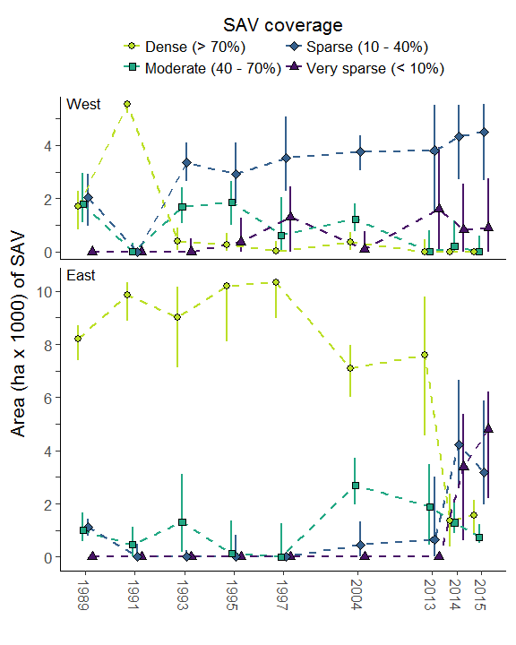

-   [Generalized Additive Models (GAMs)](#generalized-additive-models-gams)
    -   [Association between water depth and SAV](#association-between-water-depth-and-sav)
-   [Changes in SAV coverage in Lake Mattamuskeet](#changes-in-sav-coverage-in-lake-mattamuskeet)
    -   [Spatially-explicit estimates of SAV coverage](#spatially-explicit-estimates-of-sav-coverage)
    -   [Changes in SAV area, Chesapeake Bay SAV classification](#changes-in-sav-area-chesapeake-bay-sav-classification)

This document describes the summary and analysis of sampling related to submerged aquatic vegetation (SAV) in Lake Mattamuskeet. Sampling occurred in 1989, 1991, 1993, 1995, 1997, 2004, 2013, 2014, and 2015.

The specific objective of this document is:

1.  To generate spatially-explicit predictions of SAV in each sampling year and quantify trends in SAV coverage over the sampling period (1989 2015).

Generalized Additive Models (GAMs)
==================================

We used generalized additive models (GAMs) to generate spatially-explicit models of SAV coverage on the west and east basins of Lake Mattamuskeet during the nine years of SAV surveys between 1989 and 2015. See the manuscript for details of the models. Model assessment (i.e., information criteria, the percentage of deviance explained, and bootstrapped root mean squared error) invariably supported models for both basins that included:

1.  a smooth of depth by year (categorical);
2.  a spatial smooth (x, y position) by year (categorical); and
3.  a main effect of year (categorical)

The code for generating, comparing, and validating these models is contained in [`SAV_model_comparison.R`](./R/SAV_model_comparison.R).

Association between water depth and SAV
---------------------------------------

The east and west basins exhibit similar relationships between water depth and SAV coverage, but varied in the time frame of this manifestation. Early in the survey period (1989 - 1993), SAV coverage was relatively consistent across the range of measured depths for both basins, suggesting little limitations to SAV growth associated with water depth and, presumably, certain water quality attributes. Beginning in 1995 in the west basin, however, SAV coverage declined with increasing water depth, a pattern that has persisted thereafter. The same shift is apparent in the east basin, but the decline in SAV coverage associated with increasing water depth was not first observed until 2014.

The following figure illustrates the changing association between water depth and SAV. The y-axis represents the contribution to the additive predictor at a particular water depth in a given year. In terms of the proportion of SAV coverage, a contribution of 1 (-1) to the additive predictor corresponds to a 50% increase (decrease) in SAV coverage. However, the proportional change in SAV coverage with increasing contribution is not linear. For example, contributions of 2.4 (-2.4) and 6.3 (-6.3) correspond to 75% and 90% increases (decreases) in SAV coverage, respectively. Shading illustrates the 95% confidence interval of the associations and circles the deviations of the observed data from the fitted association, respectively.

    ## Loading objects:
    ##   west_dys_c
    ##   east_dys_c

Changes in SAV coverage in Lake Mattamuskeet
============================================

Spatially-explicit estimates of SAV coverage
--------------------------------------------

    ## Loading objects:
    ##   sav_rasts

Changes in SAV area, Chesapeake Bay SAV classification
------------------------------------------------------

Here we generate 1000 posterior simulations from the final GAMs to evaluate uncertainty in the spatially-explicit estimates of SAV coverage (see Figure 3). In short, the code in [`simulate_SAV_posterior.R`](%22./R/simulate_SAV_posterior.R%22) generates 1000 simulations from the final GAM models, generates the spatially-explicit estimates of SAV coverage in Lake Mattamuskeet, categorizes them according to those used in the Chesapeake Bay (see below), and then summarizes the area of Lake Mattamuskeet falling into each category. The categorization follows Chesapeake Bay (Orth et al. 2015):

-   dense (70-100%);
-   moderate (40-70%);
-   sparse (10-40%); and
-   very sparse (&lt;10% coverage)

